# ¿Qué hacer? Mérida
Es una aplicación móvil exclusiva para habitantes de la ciudad de Mérida, Yucatán; así como también a visitantes de otros estados y turistas extranjeros. La aplicación tiene como objetivo facilitar la búsqueda y ubicación de diversos sitios, negocios o servicios que la ciudad ofrece.

### Características:

- Búsqueda por zona o por categorías
- Información del lugar: descripción, dirección, teléfono, horario y redes sociales
- Guardar lugares favoritos
- Mapa de localización GPS
- Opción de compartir el lugar por redes sociales
- Servicio de publicidad dentro de la aplicación
- Incorporar un negocio a la aplicación
- Video viral de Internet


### Descripción y navegación
A continuación se describirán las diferentes páginas que componen la aplicación, su navegación y los elementos contenidos en ellas. Casi todas las pantallas se componen de un header, donde se puede encontrar el botón de retroceso, título de la pantalla, un icono o barra de búsqueda; y un icono de menú para acceder a la lista de lugares favoritos, información sobre la app, ayuda y contacto. Algunas pantallas incluyen un banner publicitario debajo del header.


### SPLASH SCREEN
Página de bienvenida que se muestra durante unos segundos al abrir la aplicación, para luego desaparecer y mostrar la página de inicio.


### HOME/PÁGINA DE INICIO
Página principal de la aplicación, contiene las principales opciones de búsqueda. La primera consiste en una búsqueda directa usando la barra de búsqueda en la parte superior. Aquí, el usuario puede ingresar el nombre del lugar que busca o palabras clave de lo que se desea localizar; inmediatamente aparecerá una lista de **RESULTADOS**.

El usuario también puede realizar una búsqueda por **ZONA** o por **CATEGORÍAS GENERALES**, cuyos botones se encuentran al centro de la página. Explorando estas dos opciones, el usuario puede conocer las distintas categorías con las que cuenta la aplicación y así encontrar todo lo que busca en un solo lugar.
Además de las opciones de búsqueda, también puede encontrarse un reproductor de video, el cual muestra distintos videos virales alojados en la plataforma de YouTube; estos pueden reproducirse sin salir de la aplicación.

En caso de que el usuario esté interesado en promocionar su negocio en la app, puede encontrar el botón “Anúnciate aquí” al pie de la página; este sirve de enlace a la página de **CONTACTANOS**.

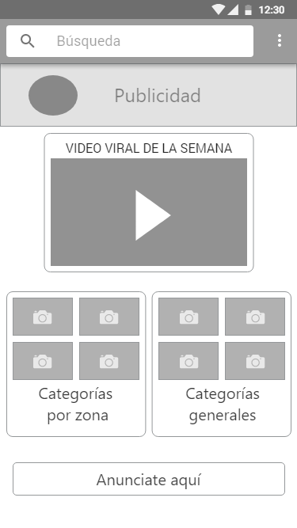

### CATEGORÍA POR ZONAS
Se accede a esta página a través de la página de **INICIO**. Muestra las principales zonas de la ciudad, de manera que todos los resultados mostrados serán exclusivos de la zona escogida, sin importar su categoría. Ordenados en retícula, cada botón posee nombre y una imagen característica.
Al escoger una **ZONA**, el usuario es dirigido a la pantalla de categorías dentro de la misma.

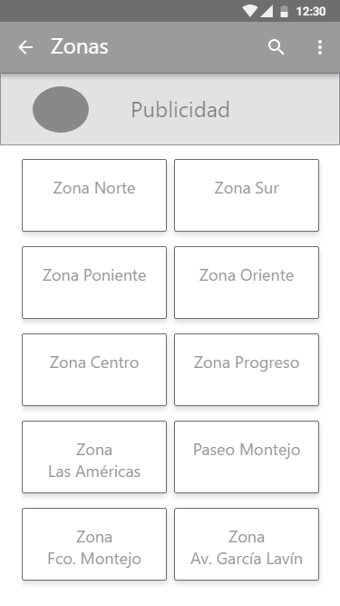

### ZONA
Después de escoger una zona, aquí se muestran las categorías disponibles para iniciar la búsqueda dentro de la misma. Estas están ordenadas en retícula, dividas por dos sliders. Cada botón de zona contiene nombre e imagen de ejemplo. Al seleccionar una categoría, algunas mostraran directamente los lugares contenidos en ellas; sin embargo, otras contienen SUBCATEGORÍAS relacionadas.

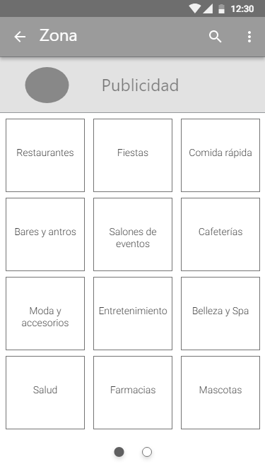

### SUBCATEGORÍAS DE ZONA
Se accede a estas al escoger algunas de las categorías de una **ZONA**. Las subcategorías están ordenadas en forma de lista y dirigen al usuario a la lista de **RESULTADOS**. A diferencia de las páginas anteriores, estás no contienen banner publicitario.

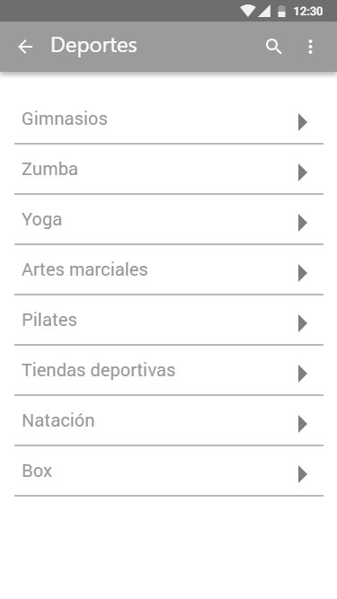

### CATEGORÍAS GENERALES
Se accede a esta página desde la página de **INICIO**. Contiene las categorías que aplican a cualquier zona de Mérida y muestran directamente la lista de **RESULTADOS** con los lugares etiquetados en estas categorías. Sin embargo, algunas contienen subcategorías para facilitar la búsqueda. A diferencia de las demás páginas, esta contiene dos banners publicitarios: uno debajo del header y otro al pie de la página.

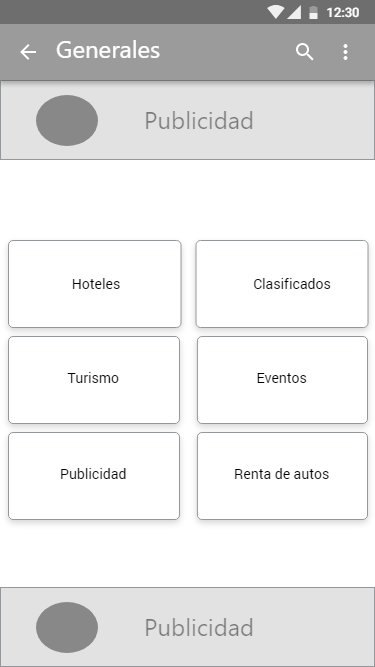

### SUBCATEGORÍAS GENERALES
Estas pertenecen a algunas de las categorías generales. Se muestran en forma de lista y dirigen al usuario a los **RESULTADOS** de la búsqueda.

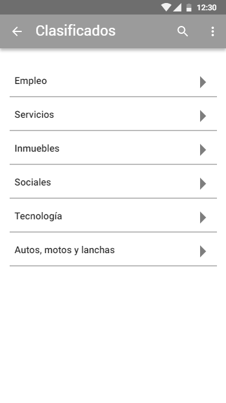

### RESULTADOS
Es aquí donde se muestran los resultados de una búsqueda realizada por el usuario.
Si se usó la barra de búsqueda en la página de **INICIO**, se mostrarán los resultados globales que concuerden con las palabras clave que se introdujeron en el buscador.
Si se realizó una búsqueda por **ZONA**, se mostrarán sólo los resultados ubicados en la zona escogida y en la categoría o subcategoría seleccionada.
Si se realizó la búsqueda por categorías **GENERALES**, se mostrarán los resultados de cada categoría o subcategoría, sin importar la zona en la que se encuentre.
Dependiendo la cantidad de resultados encontrados, estos se dividirán en sliders con 6 resultados en cada uno. Cada resultado contiene una imagen o foto del **LUGAR**, nombre, descripción breve y número de favoritos.

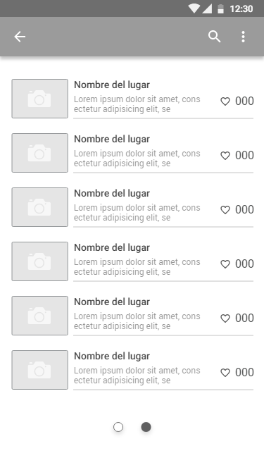

### LUGAR
Esta página contiene la información del sitio seleccionado al realizar una búsqueda. Aquí resalta la imagen o fotografía del lugar en cuestión. Al centro de la pantalla, se encuentra el botón Mapa, que funciona de enlace hacia el mapa mostrando la localización del lugar.
La información incluida consta de nombre del lugar, descripción breve, dirección, teléfono, horario de atención, y redes sociales *(Facebook, Twitter, Instagram, WhatsApp y sitio web)*. Los íconos de redes sociales, funcionan como enlaces directos a la red social de la empresa. Así mismo, el botón de compartir ubicado en la esquina derecha, permite compartir el sitio encontrado en las redes sociales del usuario (Facebook, Correo electrónico o WhatsApp). Una vez compartido el sitio en cualquier red social, debajo de la página aparecerá la frase *“Te encuentras en "{Nombre del lugar}" a través de  ¿Qué hacer? Mérida.”*
Dentro del header, puede encontrarse un botón de favoritos. Al seleccionarlo, el lugar queda guardado en la lista de favoritos ubicada en el botón menú, así es posible volver a visitar la información del lugar sin tener que buscarlo de nuevo.

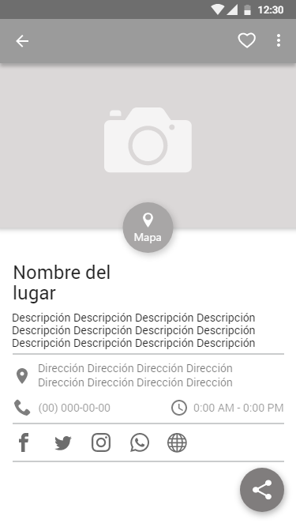

### MAPA
Muestra la ubicación exacta del sitio buscado, aquí sólo se muestra el nombre, dirección y teléfono del sitio. Si se comparte el lugar en cualquier red social, también aparecerá la frase *“Te encuentras en "{Nombre del lugar}" a través de  ¿Qué hacer? Mérida.”*

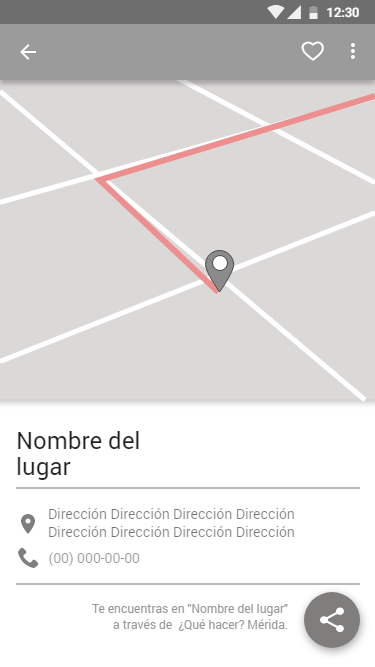

### CONTACTO
Esta página está destinada a aquellos interesados en incluir su negocio dentro de la aplicación o mostrar publicidad dentro de la misma. Contiene un pequeño formulario que solicita:
- Nombre completo
- Número teléfono *(de preferencia WhatsApp)*
- Correo electrónico
La información enviada será utilizada para ponerse en contacto con la persona y continuar así el proceso para añadir su negocio o publicidad a la aplicación.

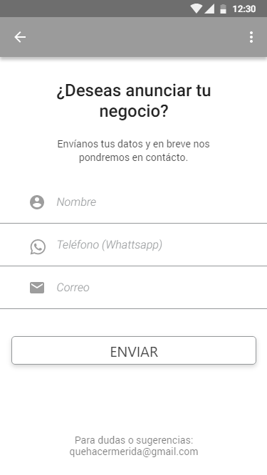

### FAVORITOS
Aquí se muestran los lugares guardados como favoritos por el usuario. Se accede a esta pantalla a través del menú.

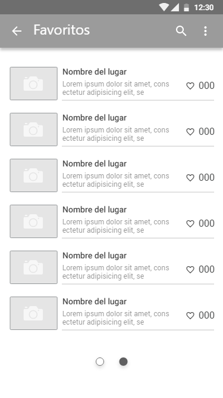

### MENU DRAWER
Es el menú desplegable que aparece desde el lado derecho de la pantalla. Contiene las opciones para ver Favoritos, un enlace directo al Home o página de Inicio y un enlace a la página de contacto.
Se accede al menú a través del icono ubicado a la derecha del header.

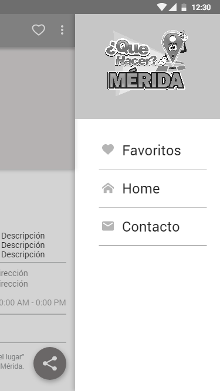


## INSTRUCCIONES DE CONTRUCCION DE APK RELEASE Y DEBUG

### APK Release
```
react-native bundle --platform android --dev false --entry-file index.android.js \
 --bundle-output android/app/src/main/assets/index.android.bundle \
 --assets-dest android/app/src/main/res/
```
### APK Debug
```
node ./node_modules/react-native/local-cli/cli.js bundle --platform android --dev false --reset-cache --entry-file index.android.js --bundle-output ./android/app/build/intermediates/assets/debug/index.android.bundle --assets-dest ./android/app/build/intermediates/res/merged/debug
```
